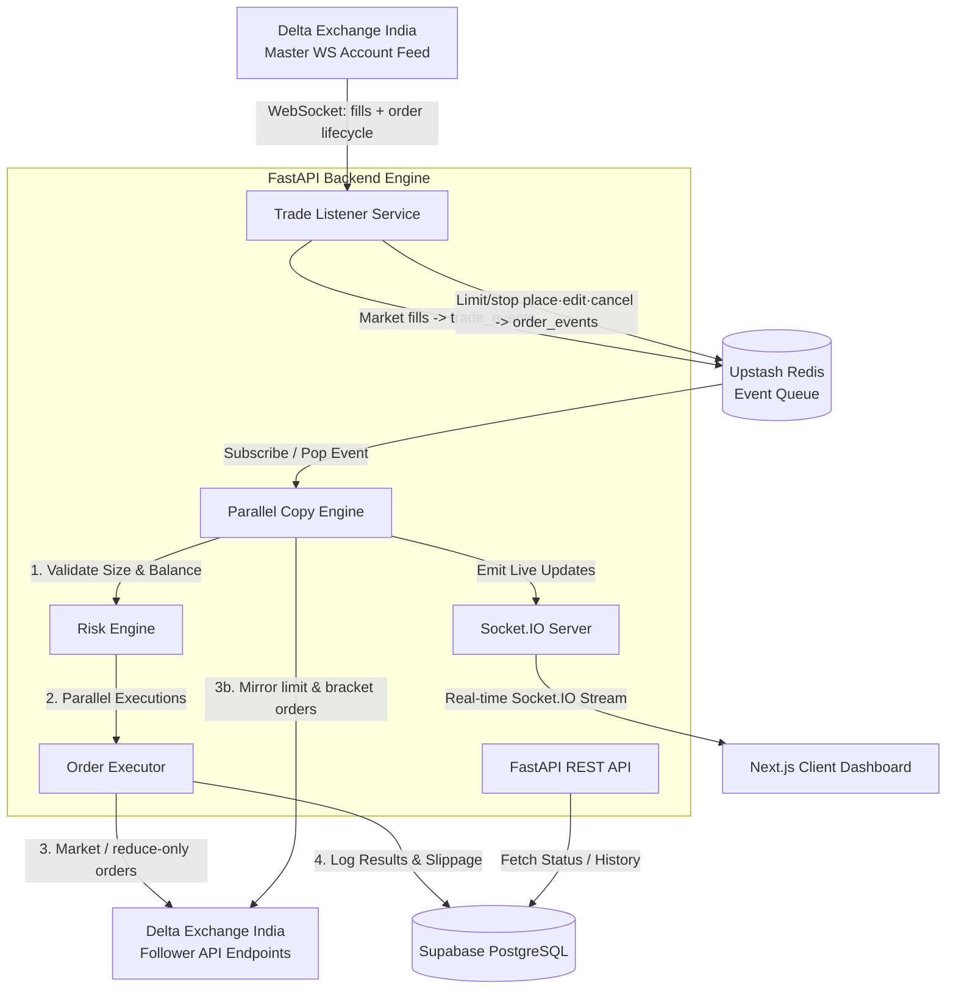

# Mirror Engine - High-Level Design (HLD)

Mirror Engine is a real-time, institutional-grade copy trading system designed for Delta Exchange India. It allows manual trades executed on a master account to be replicated near-instantaneously (with a target latency of $<200\text{ms}$ and a copy slippage margin of $\le 0.03\%$) across multiple follower accounts.

---

## 1. System Architecture

The system utilizes an event-driven, decoupled microservices architecture designed to minimize latency on the trade execution path.

---

## 2. Technology Stack

| Component | Technology | Role |
| :--- | :--- | :--- |
| **Backend Framework** | FastAPI (Python) | Host REST APIs, WebSocket handlers, and lifespan managers |
| **Real-time Queue** | Upstash Redis | Low-latency pub/sub message broker for trade events |
| **Database** | Supabase (PostgreSQL) | Persistent storage for accounts, trades, logs, and alerts |
| **WebSockets** | python-socketio | Real-time push updates to the web frontend |
| **Frontend Framework** | Next.js (TypeScript) | Admin console dashboard with light/dark theme toggle |
| **Styling** | Tailwind CSS / CSS Variables | Dynamic custom-themed styles |
| **Containerization** | Docker / Docker Compose | Standardized environment setups |

---

## 3. High-Level Data Flow

The lifecycle of a copy trade execution consists of three phases:

### Phase 1: Ingestion ($<15\text{ms}$)
1. A trader places a trade on the **Delta Exchange Master Account**.
2. The exchange triggers a fill event broadcasted over WebSockets.
3. The backend **Trade Listener Service** captures the JSON payload, checks it against the Master account filters, and serializes it into the Redis `trade_events` queue.

### Phase 2: Copy & Risk Evaluation ($<35\text{ms}$)
1. The **Copy Engine** (running parallel worker threads) pops the event from Redis.
2. It queries active followers in Supabase and routes them to the **Risk Engine**.
3. The **Risk Engine** validates follower margin balances and computes customized order sizes using the follower's allocation mode:
   * **Auto Balance Ratio** — `master_size × (follower_balance ÷ master_balance)`, floored on opens, ceiled on closes.
   * **Multiplier** — a fixed scale of the master size.
   * An optional per-account **allocated balance** overrides the real balance for this ratio (useful for testing across very different balances).

### Phase 2b: Order Mirroring (non-fill events)
Pending **limit** and **stop / SL / TP (bracket)** orders the master places, edits or cancels are routed through a separate `order_events` queue. The Copy Engine mirrors them onto followers — placing limit orders, attaching brackets via Delta's bracket endpoint (with the master's Mark/Index trigger), editing in place on price/trigger changes, and cancelling (with a self-heal lookup if the id map is stale). A master→follower order-id map is kept in Redis. Each follower's SL/TP trigger is jittered by ±(10–50) so they don't all fire simultaneously.

### Phase 3: Parallel Execution & Logging ($<150\text{ms}$)
1. The **Order Executor** converts the allocation into direct REST market orders on Delta Exchange.
2. Orders for all followers are fired concurrently using asynchronous requests.
3. Post-execution prices are compared against the Master's entry price to log slippage.
4. Records are written to Supabase and immediately pushed to active frontend browsers via **Socket.IO**.

---

## 4. Key Performance Indicators (KPIs)

* **Execution Latency**: Target end-to-end copy latency is $<200\text{ms}$ from master fill detection to follower submission.
* **Slippage Threshold**: Maximum acceptable price difference between Master and Follower is $0.03\%$ (3 basis points). Any slippage exceeding this limit raises a warning alert.
* **Circuit Breakers**: If a follower account encounters 5 consecutive execution failures, the account status is automatically set to `blocked` and copy activities are suspended.
