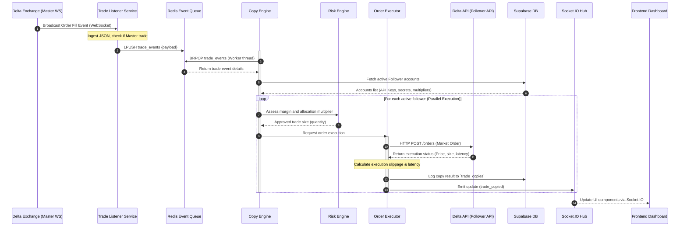

# Mirror Engine - Low-Level Design (LLD)

This document describes the low-level design, database structures, class definitions, and internal mechanisms of the **Mirror Engine** copy trading system.

---

## 1. Database Schema (Supabase PostgreSQL)

The backend system manages five main tables inside Supabase. Foreign keys link followers back to original trade event logs.

### 1.1 `accounts` Table
Stores Delta Exchange credentials and parameters for the Master and Follower accounts.
| Column | Type | Constraints | Description |
| :--- | :--- | :--- | :--- |
| `id` | UUID | PRIMARY KEY, DEFAULT gen_random_uuid() | Unique identifier |
| `name` | VARCHAR | NOT NULL | Readable name |
| `account_type` | VARCHAR | NOT NULL (CHECK: master, follower) | Account classification |
| `api_key` | VARCHAR | NOT NULL | Delta Exchange API Key |
| `api_secret` | VARCHAR | NOT NULL | Delta Exchange API Secret |
| `allocation_pct` | NUMERIC | DEFAULT 100.0 | Follower allocation percentage |
| `is_active` | BOOLEAN | DEFAULT TRUE | Active copying flag |
| `status` | VARCHAR | DEFAULT 'active' (active, paused, blocked) | Health status |
| `created_at` | TIMESTAMPTZ | DEFAULT NOW() | Timestamp |

### 1.2 `trades` Table
Logs master order filled events captured from the Delta Exchange WebSocket feed.
| Column | Type | Constraints | Description |
| :--- | :--- | :--- | :--- |
| `id` | UUID | PRIMARY KEY | Unique identifier |
| `symbol` | VARCHAR | NOT NULL | Delta contract code (e.g. `BTCUSD`) |
| `side` | VARCHAR | NOT NULL (buy, sell) | Order side |
| `qty` | NUMERIC | NOT NULL | Filled quantity |
| `entry_price` | NUMERIC | NOT NULL | Weighted average execution price |
| `status` | VARCHAR | DEFAULT 'pending' (copied, partial, failed) | Overall execution status |
| `created_at` | TIMESTAMPTZ | DEFAULT NOW() | Ingestion timestamp |

### 1.3 `trade_copies` Table
Stores copying execution parameters and outputs for every follower account.
| Column | Type | Constraints | Description |
| :--- | :--- | :--- | :--- |
| `id` | UUID | PRIMARY KEY | Copy execution identifier |
| `trade_id` | UUID | FOREIGN KEY REFERENCES `trades(id)` | Associated master trade |
| `account_id` | UUID | FOREIGN KEY REFERENCES `accounts(id)` | Target follower account |
| `qty` | NUMERIC | NOT NULL | Follower copy size |
| `execution_price`| NUMERIC | - | Follower average entry price |
| `slippage_pct` | NUMERIC | - | Slippage percentage relative to master |
| `status` | VARCHAR | NOT NULL (filled, failed) | Individual copy task state |
| `error_message` | VARCHAR | - | Reason for failure (if any) |
| `latency_ms` | INTEGER | - | End-to-end copy time in milliseconds |
| `created_at` | TIMESTAMPTZ | DEFAULT NOW() | Log creation time |

### 1.4 `positions` Table
Tracks real-time open positions for master/follower accounts to check size drift.
| Column | Type | Constraints | Description |
| :--- | :--- | :--- | :--- |
| `id` | UUID | PRIMARY KEY | Unique identifier |
| `account_id` | UUID | FOREIGN KEY REFERENCES `accounts(id)` | Account owner |
| `symbol` | VARCHAR | NOT NULL | Symbol name |
| `size` | NUMERIC | NOT NULL (Signed: + for Long, - for Short) | Net position size |
| `entry_price` | NUMERIC | NOT NULL | Entry average price |
| `sync_status` | VARCHAR | DEFAULT 'synced' (synced, desynced) | Drift status relative to master |
| `updated_at` | TIMESTAMPTZ | DEFAULT NOW() | Last update timestamp |

### 1.5 `alerts` Table
Records critical system indicators, excessive slippages, and socket failures.
| Column | Type | Constraints | Description |
| :--- | :--- | :--- | :--- |
| `id` | UUID | PRIMARY KEY | Alert identifier |
| `account_id` | UUID | FOREIGN KEY REFERENCES `accounts(id)` | Affected account |
| `severity` | VARCHAR | CHECK (info, warning, critical) | Alert level |
| `message` | TEXT | NOT NULL | Description |
| `is_resolved` | BOOLEAN | DEFAULT FALSE | Status flag |
| `created_at` | TIMESTAMPTZ | DEFAULT NOW() | Incident timestamp |

---

## 2. Sequence Diagram (Order Copy Flow)

The interaction pattern below demonstrates step-by-step latency-bound actions when a trade event fires.

---

## 3. Mathematical Specifications

### 3.1 Allocation Sizing Formula
Follower copy quantity ($Q_{f}$) is calculated using the master's filled quantity ($Q_{m}$), follower allocation percentage ($A_{f}$), and risk multiplier parameters:

$$Q_{f} = Q_{m} \times \left( \frac{A_{f}}{100} \right)$$

*Example*: If a master enters $10.0$ contracts of `BTCUSD` and the follower has an allocation of $50\%$, the follower copy size is $5.0$ contracts.

### 3.2 Slippage Percentage Formula
Slippage ($S_{pct}$) measures the premium or discount paid by the follower compared to the master's entry price. For BUY trades:

$$S_{pct} = \left( \frac{P_{follower} - P_{master}}{P_{master}} \right) \times 100$$

For SELL trades:

$$S_{pct} = \left( \frac{P_{master} - P_{follower}}{P_{master}} \right) \times 100$$

*   **Positive value ($>0$)**: Worse price (unfavorable slippage).
*   **Negative value ($<0$)**: Better price (favorable slippage).
*   **Warning Threshold**: Triggered when $S_{pct} \ge 0.03\%$.

### 3.3 Position Drift Formula
Drift percentage ($D_{pct}$) checks if followers' net positions have drifted from their expected size:

$$ExpectedSize = Size_{master} \times \left( \frac{A_{f}}{100} \right)$$

$$D_{pct} = \left| \frac{Size_{follower} - ExpectedSize}{ExpectedSize} \right| \times 100$$

*   **Desynced Trigger**: If $D_{pct} > 5\%$, the follower position is marked as `desynced` in Supabase and a Warning Alert is logged.

---

## 4. Code Architecture (Backend Layout)

*   [delta_client.py](file:///d:/Work/Projects/trades_copy/backend/app/services/delta_client.py): Async HTTP client utilizing standard Python `httpx` to handle signed HMAC requests to Delta Exchange API.
*   [risk_engine.py](file:///d:/Work/Projects/trades_copy/backend/app/core/risk_engine.py): Performs pre-trade allocation sizing and check limits.
*   [order_executor.py](file:///d:/Work/Projects/trades_copy/backend/app/core/order_executor.py): Handles parallel order dispatch with HTTP connection pooling. It tracks follower health statuses and implements a circuit breaker (5 consecutive failures block the account).
*   [copy_engine.py](file:///d:/Work/Projects/trades_copy/backend/app/core/copy_engine.py): Contains the broker-consumer loop, translating master trade events from Redis into multiple parallel follower execution tasks.
*   [connection_manager.py](file:///d:/Work/Projects/trades_copy/backend/app/core/connection_manager.py): Client WebSocket session pool manager running singleton exports to stream real-time updates to connected browsers.
*   [trade_listener.py](file:///d:/Work/Projects/trades_copy/backend/app/core/trade_listener.py): Real-time trade filter service that listens to the Delta Exchange Master WS stream, parses raw fill payloads, and serializes copyable events to the Redis queue.
*   [position_monitor.py](file:///d:/Work/Projects/trades_copy/backend/app/core/position_monitor.py): Periodic task that audits open position sync status and flags desynced profiles when size drift surpasses 5%.
*   [slippage_tracker.py](file:///d:/Work/Projects/trades_copy/backend/app/core/slippage_tracker.py): Tracks trade copy metrics, calculates exact slippage margins, and posts warnings if the execution price variance is greater than 0.03%.
