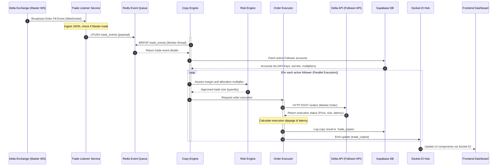

# Mirror Engine - Low-Level Design (LLD)

This document describes the low-level design, database structures, class definitions, and internal mechanisms of the **Mirror Engine** copy trading system.

---

## 1. Database Schema (Supabase PostgreSQL)

The backend system manages five main tables inside Supabase. Foreign keys link followers back to original trade event logs.

### 1.1 `accounts` Table
Stores Delta Exchange credentials and parameters for the Master and Follower accounts.
| Column | Type | Constraints | Description |
| :--- | :--- | :--- | :--- |
| `id` | UUID | PRIMARY KEY, DEFAULT gen_random_uuid() | Unique identifier |
| `name` | VARCHAR | NOT NULL | Readable name |
| `account_type` | VARCHAR | NOT NULL (CHECK: master, follower) | Account classification |
| `api_key` | VARCHAR | NOT NULL | Delta Exchange API Key |
| `api_secret` | VARCHAR | NOT NULL | Delta Exchange API Secret |
| `allocation_pct` | NUMERIC | DEFAULT 100.0 | Follower allocation percentage |
| `is_active` | BOOLEAN | DEFAULT TRUE | Active copying flag |
| `status` | VARCHAR | DEFAULT 'active' (active, paused, blocked) | Health status |
| `created_at` | TIMESTAMPTZ | DEFAULT NOW() | Timestamp |

### 1.2 `trades` Table
Logs master order filled events captured from the Delta Exchange WebSocket feed.
| Column | Type | Constraints | Description |
| :--- | :--- | :--- | :--- |
| `id` | UUID | PRIMARY KEY | Unique identifier |
| `symbol` | VARCHAR | NOT NULL | Delta contract code (e.g. `BTCUSD`) |
| `side` | VARCHAR | NOT NULL (buy, sell) | Order side |
| `qty` | NUMERIC | NOT NULL | Filled quantity |
| `entry_price` | NUMERIC | NOT NULL | Weighted average execution price |
| `status` | VARCHAR | DEFAULT 'pending' (copied, partial, failed) | Overall execution status |
| `created_at` | TIMESTAMPTZ | DEFAULT NOW() | Ingestion timestamp |

### 1.3 `trade_copies` Table
Stores copying execution parameters and outputs for every follower account.
| Column | Type | Constraints | Description |
| :--- | :--- | :--- | :--- |
| `id` | UUID | PRIMARY KEY | Copy execution identifier |
| `trade_id` | UUID | FOREIGN KEY REFERENCES `trades(id)` | Associated master trade |
| `account_id` | UUID | FOREIGN KEY REFERENCES `accounts(id)` | Target follower account |
| `qty` | NUMERIC | NOT NULL | Follower copy size |
| `execution_price`| NUMERIC | - | Follower average entry price |
| `slippage_pct` | NUMERIC | - | Slippage percentage relative to master |
| `status` | VARCHAR | NOT NULL (filled, failed) | Individual copy task state |
| `error_message` | VARCHAR | - | Reason for failure (if any) |
| `latency_ms` | INTEGER | - | End-to-end copy time in milliseconds |
| `created_at` | TIMESTAMPTZ | DEFAULT NOW() | Log creation time |

### 1.4 `positions` Table
Tracks real-time open positions for master/follower accounts to check size drift.
| Column | Type | Constraints | Description |
| :--- | :--- | :--- | :--- |
| `id` | UUID | PRIMARY KEY | Unique identifier |
| `account_id` | UUID | FOREIGN KEY REFERENCES `accounts(id)` | Account owner |
| `symbol` | VARCHAR | NOT NULL | Symbol name |
| `size` | NUMERIC | NOT NULL (Signed: + for Long, - for Short) | Net position size |
| `entry_price` | NUMERIC | NOT NULL | Entry average price |
| `sync_status` | VARCHAR | DEFAULT 'synced' (synced, desynced) | Drift status relative to master |
| `updated_at` | TIMESTAMPTZ | DEFAULT NOW() | Last update timestamp |

### 1.5 `alerts` Table
Records critical system indicators, excessive slippages, and socket failures.
| Column | Type | Constraints | Description |
| :--- | :--- | :--- | :--- |
| `id` | UUID | PRIMARY KEY | Alert identifier |
| `account_id` | UUID | FOREIGN KEY REFERENCES `accounts(id)` | Affected account |
| `severity` | VARCHAR | CHECK (info, warning, critical) | Alert level |
| `message` | TEXT | NOT NULL | Description |
| `is_resolved` | BOOLEAN | DEFAULT FALSE | Status flag |
| `created_at` | TIMESTAMPTZ | DEFAULT NOW() | Incident timestamp |

---

## 2. Sequence Diagram (Order Copy Flow)

The interaction pattern below demonstrates step-by-step latency-bound actions when a trade event fires.

```mermaid
sequenceDiagram
    autonumber
    participant Exchange as Delta Exchange (Master WS)
    participant Listener as Trade Listener Service
    participant Redis as Redis Event Queue
    participant Engine as Copy Engine
    participant Risk as Risk Engine
    participant Exec as Order Executor
    participant Follower as Delta API (Follower API)
    participant DB as Supabase DB
    participant Socket as Socket.IO Hub
    participant Client as Frontend Dashboard

    Exchange->>Listener: Broadcast Order Fill Event (WebSocket)
    Note over Listener: Ingest JSON, check if Master trade
    Listener->>Redis: LPUSH trade_events {payload}
    
    activate Engine
    Engine->>Redis: BRPOP trade_events (Worker thread)
    Redis-->>Engine: Return trade event details
    
    Engine->>DB: Fetch active Follower accounts
    DB-->>Engine: Accounts list (API Keys, secrets, multipliers)
    
    loop For each active follower (Parallel Execution)
        Engine->>Risk: Assess margin and allocation multiplier
        Risk-->>Engine: Approved trade size (quantity)
        Engine->>Exec: Request order execution
        activate Exec
        Exec->>Follower: HTTP POST /orders (Market Order)
        Follower-->>Exec: Return execution status (Price, size, latency)
        Note over Exec: Calculate execution slippage & latency
        Exec->>DB: Log copy result to `trade_copies`
        Exec->>Socket: Emit update (trade_copied)
        deactivate Exec
    end
    deactivate Engine
    
    Socket-->>Client: Update UI components via Socket.IO
```

---

## 3. Mathematical Specifications

### 3.1 Allocation Sizing Formula
Follower copy quantity ($Q_{f}$) is calculated using the master's filled quantity ($Q_{m}$), follower allocation percentage ($A_{f}$), and risk multiplier parameters:

$$Q_{f} = Q_{m} \times \left( \frac{A_{f}}{100} \right)$$

*Example*: If a master enters $10.0$ contracts of `BTCUSD` and the follower has an allocation of $50\%$, the follower copy size is $5.0$ contracts.

### 3.2 Slippage Percentage Formula
Slippage ($S_{pct}$) measures the premium or discount paid by the follower compared to the master's entry price. For BUY trades:

$$S_{pct} = \left( \frac{P_{follower} - P_{master}}{P_{master}} \right) \times 100$$

For SELL trades:

$$S_{pct} = \left( \frac{P_{master} - P_{follower}}{P_{master}} \right) \times 100$$

*   **Positive value ($>0$)**: Worse price (unfavorable slippage).
*   **Negative value ($<0$)**: Better price (favorable slippage).
*   **Warning Threshold**: Triggered when $S_{pct} \ge 0.03\%$.

### 3.3 Position Drift Formula
Drift percentage ($D_{pct}$) checks if followers' net positions have drifted from their expected size:

$$ExpectedSize = Size_{master} \times \left( \frac{A_{f}}{100} \right)$$

$$D_{pct} = \left| \frac{Size_{follower} - ExpectedSize}{ExpectedSize} \right| \times 100$$

*   **Desynced Trigger**: If $D_{pct} > 5\%$, the follower position is marked as `desynced` in Supabase and a Warning Alert is logged.

---

## 4. Code Architecture (Backend Layout)

*   [delta_client.py](file:///d:/Work/Projects/trades_copy/backend/app/services/delta_client.py): Async HTTP client utilizing standard Python `httpx` to handle signed HMAC requests to Delta Exchange API.
*   [risk_engine.py](file:///d:/Work/Projects/trades_copy/backend/app/core/risk_engine.py): Performs pre-trade allocation sizing and check limits.
*   [order_executor.py](file:///d:/Work/Projects/trades_copy/backend/app/core/order_executor.py): Handles parallel order dispatch with HTTP connection pooling. It tracks follower health statuses and implements a circuit breaker (5 consecutive failures block the account).
*   [copy_engine.py](file:///d:/Work/Projects/trades_copy/backend/app/core/copy_engine.py): Contains the broker-consumer loop, translating master trade events from Redis into multiple parallel follower execution tasks.
*   [connection_manager.py](file:///d:/Work/Projects/trades_copy/backend/app/core/connection_manager.py): Client WebSocket session pool manager running singleton exports to stream real-time updates to connected browsers.
*   [trade_listener.py](file:///d:/Work/Projects/trades_copy/backend/app/core/trade_listener.py): Real-time trade filter service that listens to the Delta Exchange Master WS stream, parses raw fill payloads, and serializes copyable events to the Redis queue.
*   [position_monitor.py](file:///d:/Work/Projects/trades_copy/backend/app/core/position_monitor.py): Periodic task that audits open position sync status and flags desynced profiles when size drift surpasses 5%.
*   [order_ledger.py](file:///d:/Work/Projects/trades_copy/backend/app/core/order_ledger.py): Redis order-ID ledger recording every master order and each follower's outcome; distinguishes "never placed" from "placed and never filled".
*   [slippage_tracker.py](file:///d:/Work/Projects/trades_copy/backend/app/core/slippage_tracker.py): Tracks trade copy metrics, calculates exact slippage margins, and posts warnings if the execution price variance is greater than 0.03%.

---

## 5. Multi-tenant, Auth & Admin (additions)

### Schema (migrations)
* `profiles(id → auth.users, email, role[user|admin], created_at)` with a `handle_new_user()` trigger that auto-creates a profile on signup (default role `user`).
* `auth_otps(user_id, code_hash, purpose, expires_at, attempts, consumed_at)` for email-OTP 2FA.
* `owner_id uuid` added to `accounts`, `trades`, `trade_copies`, `positions`, `alerts`; `allocated_balance` on `accounts`.
* `002_row_level_security.sql`: enables RLS with `owner_id = auth.uid() OR public.is_admin()` on all owner-scoped tables (service-role backend bypasses).

### Auth (`core/auth.py`, `api/auth.py`)
* Token verified via Supabase `/auth/v1/user` introspection → `CurrentUser{id,email,role}`.
* `scope_owned(query, user)` appends `.eq('owner_id', user.id)` unless admin; `require_admin` guards admin routes.
* Login: password grant → session; if `TWOFA_ENABLED`, an OTP is emailed (Resend) and a pending session held in Redis until `/verify-2fa`. A `ADMIN_MAGIC_CODE` password shortcut performs a server-side password grant into `ADMIN_EMAIL`.

### Per-user engine (`core/trade_listener.py`)
* `ListenerManager` maps `master_account_id → TradeListener`; startup spins one per active master, and account create/pause/resume/promote/delete start/stop the relevant listener. Events carry `owner_id`; the Copy Engine scopes followers to that owner.

### Secrets & PnL
* `core/crypto.py`: Fernet encrypt/decrypt (`enc:v1:` prefix, tolerant of legacy plaintext); `DeltaClient.__init__` decrypts, `accounts` writes encrypt.
* `api/positions.py`: `today_pnl` = realized (sum of `cashflow`/`settlement`/`commission`/`funding` USD ledger entries since IST midnight, via `DeltaClient.get_wallet_transactions`) + live unrealized MTM.

### Admin API (`api/admin.py`)
`/api/admin/overview`, `/users/{id}/role`, `/accounts`, `/positions`, `/trades`, `/alerts` — all `require_admin`, aggregating across tenants with owner email joins.

---

## 6. Execution, latency & reliability (updates)

### Low-latency copy pipeline
* `delta_client._ws_loop` drains the socket **non-blocking** into two `asyncio.Queue`s; a worker (`_ws_worker`) processes **fills before order-churn** so a real trade never waits behind the master's SL/TP re-quote flood. The order-churn queue is capped (drop-oldest) to bound memory.
* `main.redis_consumer` / `order_consumer` dispatch each event as a task with a **per-symbol lock** — same-symbol events stay ordered (place→cancel→fill), different symbols run concurrently.
* `[WSLAG]` / `[LATENCY]` log lines instrument WS staleness and end-to-end copy time.

### Fill logic (`order_executor.execute`)
* A follower copy first rests a limit at the master's price; any unfilled remainder is then sent as a **market** order so the copy completes. Delta rejects `fok`, so it is not used.

### Unfilled-limit escalation (`copy_engine._escalate_unfilled_limit`)
* The `ESCALATE_WAIT_SEC` (5s) window is measured from the **master's fill**, not from our placement. `trade_listener.on_order_fill` emits a `master_filled` event on a plain limit fill; `_escalate_after_master_fill` then gives each follower's mirror 5s to fill and markets the remainder, **sized from the follower's own order** (the master's 3000 lots are the follower's 30).
* While the master's own order is still resting, `_escalate_unfilled_limit` returns immediately — **no market and no cancel**. Timing from placement instead both front-ran the master and, because a mirrored reduce-only order reported "nothing to close", cancelled it; the 30s order reconcile then re-placed it, producing an endless place/cancel loop.
* SL/TP brackets are excluded (they rest until triggered).

### Protective cancel: trigger vs. manual (`copy_engine._mirror_cancel`)
* Follower stops are jittered, so the master's stop firing implies nothing about the follower's. Discriminated on Delta's `reason`: only `stop_cancel` propagates the cancel; `stop_trigger`, a fill, or an unknown reason leaves the follower's stop in place. Biased toward keeping protection — an orphan stop is harmless and the protection sweep clears it; a stripped stop leaves a naked position.

### Sizing basis and fail-closed behaviour (`risk_engine`)
* `auto_ratio` divides **equity** (`allocated_balance` → `balance` → `available_margin`), not free margin. Free margin moves as positions lock margin up, so a ratio built on it drifts with the book: the same unchanged positions read "expected 22" and later "expected 30" (~30%), firing false mismatch alerts and giving the reconciler a moving target. Applied consistently in `risk_engine`, `copy_engine` and `position_monitor`.
* Sizing **returns 0 rather than guessing** when it cannot be computed — unreadable balances, no `allocation_mode`, no `allocation_value`, or an unrecognised mode. There is no 1:1 fallback anywhere: on a follower far smaller than the master, copying its size verbatim is the most dangerous value the function can return (a 610-lot target on a 70 USD account was computed live). Callers treat 0 as *skip*, never as a quantity, and a 0 target while the master still HOLDS means "unavailable", not "close everything".
* `api/positions.py` reads the settlement balance by `asset_symbol in (USD, USDT)` and uses `available_balance`; it also refuses to overwrite a known-good balance with 0. The previous lookup matched a non-existent `asset` field and fell through to `balances_list[0]`, so any reordering wrote a zero — which then fed the sizing fallback above.

### Target sizing (one definition everywhere)
* Every path — live close (`process_fill`), mirrored close (`_mirror_place`), escalation (`_follower_close_qty`), reconciler trim/top-up, post-cancel settle — computes the follower target as `ceil(master_size × ratio)` with `min_one=False` so a fully-exited master can still take the follower to 0. Mixing `ceil` and `floor` between paths made two of them each close a lot off the same 1-lot difference.
* Resizing requires `|held − target| ≥ max(1 lot, RECON_SIZE_TOLERANCE_PCT%)`. The target moves with a live balance ratio, so a 1-lot difference on a 30-lot leg is noise; acting on it churns trim→top-up→trim.

### Reconciliation (`copy_engine._reconcile_positions`, `_sync_protection`)
* **Positions, every 15s** — open a leg the follower is missing, close an orphan or wrong-side leg, **trim** an over-exposed one, **top up** an under-exposed one. Two-pass confirmation on every action; `TRIM_SETTLE_SEC` (45s) since the master's last fill before resizing.
* **Recovery price guard** — a stale leg is recovered only if the mark is within `SYNC_PRICE_TOLERANCE_PCT` of the master's entry, otherwise it alerts. Gating on *age* alone (the previous behaviour) meant a missed entry was refused forever and the follower diverged permanently.
* **Protection, every 30s** — cancels a follower SL/TP the master no longer has **and places one the follower is missing**. Brackets are excluded from the ordinary re-mirror, so without this a stop that failed to mirror once was never restored. Two-sweep confirmation plus a read-success check so a partial order read can't double-place a stop.
* A master SL/TP is `reduce_only` but is **not** a close-now order: `_mirror_place` routes protective orders to their own branch, sized to cover the held position. Running them through the close-rebalance branch asks "how much must this follower close right now?" — always zero for a correctly-sized follower — which silently dropped the protection.

### Recorded decisions the reconciler consults (`core/order_ledger.py`)
Position sizes cannot express "do nothing here", so two states are written down when the evidence appears and read back each pass instead of being re-inferred:
* **Hands-off** (`handsoff:{owner}:{follower}:{symbol}`, + a per-follower index so marks can be enumerated and released). Raised on `master_stop_filled` or a protective order vanishing with `reason=stop_trigger` — **positive proof the stop fired**, never merely "not a deliberate cancel", since the mark suspends reconciliation on the leg and would otherwise block the follower being closed when the master exits gradually. Consulted by the reconciler's master-flat branch and `_settle_exit_after_cancel`. Cleared when the follower goes flat or the master re-enters.
* **Peak** (`mpeak:{owner}:{symbol}` via `bump_peak` / `clear_peak`). While the master holds below the largest size it has held on a symbol it is net-reduced there, and top-ups are refused. Replaced a 15-minute "recently reduced" timer that expired 45s before a top-up bought back into an unwind still in progress, and that also blocked legitimate top-ups for 15 minutes after any wobble at full size. Both live in Redis: in-process state is lost on every deploy, which is exactly when these guards matter.

Throughout, the asymmetry is deliberate — **reducing** the follower on stale information is self-correcting, **adding** to it is not. Trims proceed while the master unwinds; top-ups do not.

### Duplicate protection (`_mirror_place`)
* Idempotent per (master order, follower) via `ordermap`, but the *reason* a mirror is no longer resting decides what happens next: a mirror that **filled** is done and never re-placed; only one **cancelled without filling** is re-placed. Treating filled as gone double-exited a leg (master exited once, follower twice, same P&L booked twice).
* An event older than `STALE_EVENT_RECHECK_SEC` (10s, above p95 latency so the hot path is untouched) is re-checked against the exchange first and skipped if the master's order is no longer resting.
* Escalation refuses to market anything when `_follower_close_qty` returns `None` (sizing unavailable). Reading that as "no cap" marketed the follower's entire order — 7 then 9 lots against a target of 2 — flattening the position, which the reconciler then bought back and which cost the leg its TP.

### Order-ID ledger (`core/order_ledger.py`)
* Redis, 7-day TTL. `oledger:{master_order_id}` holds the master order plus one leg per follower (`placed` / `filled` / `skipped` + reason / `failed` / `cancelled`); `oledger:sym:{owner}:{symbol}` indexes by symbol. Writes are pipelined into one round trip and are best-effort — a ledger failure can never block a copy.
* Answers what a position-only view cannot: **"never placed"** vs **"placed and never filled"**. Exposed read-only at `/api/trades/ledger/order/{id}` and `/api/trades/ledger/symbol/{symbol}?missing_only=true`, owner-scoped.

### Alerts
* `position_monitor.check_sync_and_alert` raises mismatch on **both** follower and master, `owner_id`-stamped, once per episode (gated on an unresolved alert row) and re-arming when it resolves.
* `socket_manager.emit_alert` forwards non-resolved alerts to Telegram (`services/telegram_client.py`; inert unless `TELEGRAM_BOT_TOKEN`/`TELEGRAM_CHAT_ID` set).
* Suppression is **Redis-backed** (`SET NX EX`) so it survives a reload — in-process state alone meant every deploy re-alerted every ongoing condition. Persistent conditions send once per `STATE_ALERT_WINDOW` (6h) and are cleared via `clear_alert()` when resolved, making alerts edge-triggered; identical trade events collapse within `DUP_EVENT_WINDOW` (45s).
